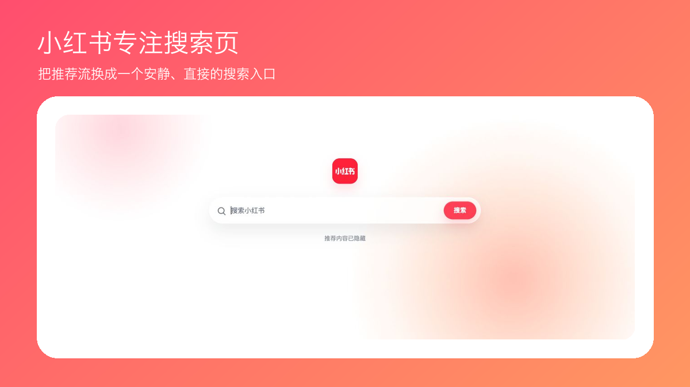
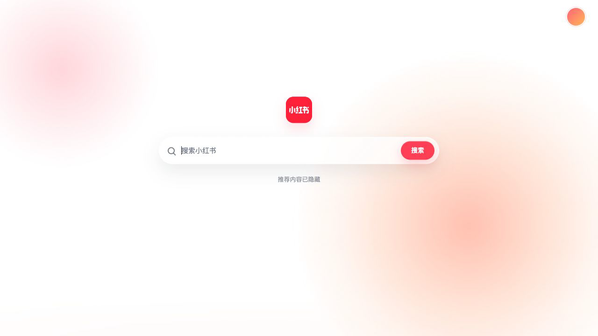
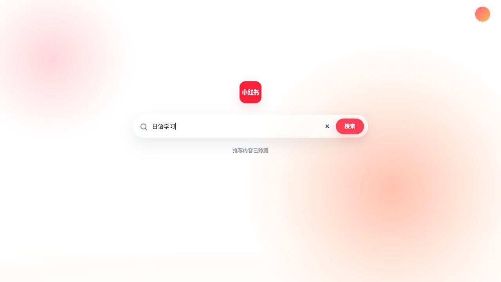

<p align="center"></p>

<h1 align="center">小红书专注搜索页</h1>
<p align="center">打开小红书，先搜索，不被推荐流带走。</p>

<p align="center">
  
  
  
</p>

## 功能一览

### 打开就是专注页

推荐内容自动退场，只留下一个安静、清晰的搜索入口。

<p align="center"></p>

### 想搜什么，直接输入

输入主题后进入小红书原生搜索结果，不接管后续浏览体验。

<p align="center"></p>

### 账号入口仍在手边

右上角保留当前账号入口，需要时可以快速回到自己的内容。

<p align="center"></p>

## 它做什么

- 只在小红书 `/explore` 页面显示一个安静的搜索入口。
- 搜索后进入小红书原生结果页，不覆盖搜索页或个人主页。
- 自动从当前页面识别已登录账号，头像入口跳转到该账号的收藏页。
- 不拦截请求、不抓取内容、不保存搜索词，也不修改账号状态。

## 本地安装

1. 克隆或下载本仓库。
2. 在 Chrome 打开 `chrome://extensions/`。
3. 开启“开发者模式”，选择“加载已解压的扩展程序”。
4. 选择本仓库根目录。

Chrome 会持续读取这个目录，因此本地使用期间请保留该工作副本。

## 隐私与安全

扩展没有运行时权限、后台脚本、远程代码、网络请求或存储能力。账号标识不会写入源码或扩展存储，只在页面运行时临时读取个人主页链接。DOM 尚未加载时，头像入口会安全回退到小红书通用个人主页。

## 验证

```bash
npm run check
```

完整检查包含单元测试、Manifest/权限约束和文档校验。

## License

源码使用 [MIT License](LICENSE)。这是非官方独立项目；小红书名称、商标和第三方资源不包含在 MIT 授权中，详见 [NOTICE](NOTICE.md)。
